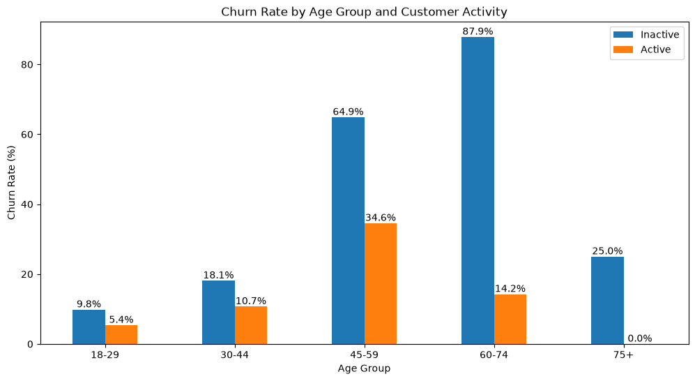
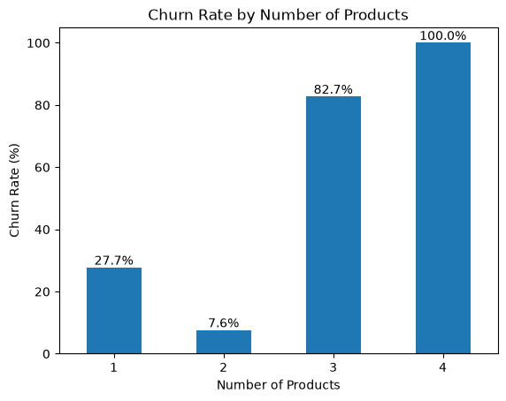
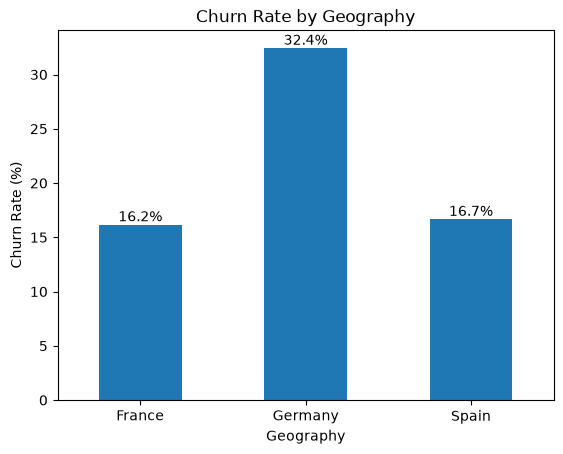

# Bank Customer Churn Analysis

Exploratory analysis of 10,000 bank customers to identify patterns associated with customer churn.

The goal of this project is to understand which customer characteristics are associated with a higher churn rate and identify segments that may require further investigation.

## Tools and Technologies

- **SQL** — data extraction
- **Python** — data analysis
- **Pandas** — data manipulation and aggregation
- **Matplotlib** — data visualization
- **Jupyter Notebook** — analysis workflow

## Dataset

The dataset contains 10,000 customer records.

Each row represents one bank customer and includes information about:

- customer demographics, such as age and geography
- account balance and estimated salary
- number of bank products
- customer activity
- complaints
- churn status (`Exited`)

## Analysis Approach

The analysis was performed in several steps:

- checked the dataset for missing values and duplicate rows
- calculated the overall churn rate
- analyzed churn by complaints and customer activity
- compared churn across age groups and activity levels
- analyzed the relationship between churn and account balance
- compared churn across different numbers of products and countries
- summarized the main findings, limitations, and possible areas for further analysis

## Key Findings

- **Customer complaints:** Customers who submitted a complaint had a churn rate of 99.5%, compared with only 0.05% among customers without a complaint. This relationship is unusually strong and should be interpreted with caution.

- **Customer activity and age:** Inactive customers had a higher churn rate than active customers: 26.9% versus 14.3%. The difference was especially large among customers aged 60–74, where churn reached 87.9% for inactive customers and 14.2% for active customers.

- **Number of products:** Customers with two products had the lowest churn rate at 7.6%. Customers with three and four products showed much higher churn rates of 82.7% and 100%, although these groups were considerably smaller.

- **Geography:** Customers from Germany had a churn rate of 32.4%, almost twice the rate observed in France (16.2%) and Spain (16.7%).

- **Balance:** Customers with a positive balance had a higher churn rate than customers with a zero balance: 24.1% versus 13.8%. However, churn did not consistently increase as balance grew.

## Visualizations

### Churn Rate by Age Group and Customer Activity



### Churn Rate by Number of Products



### Churn Rate by Geography



## Limitations

- The dataset does not contain event timestamps, so the temporal relationship between complaints and churn cannot be established.
- Some customer segments are small, especially customers aged 75+ and customers with three or four products.
- The dataset provides the number of products but not their specific types.
- The analysis identifies associations, not causal relationships.

## Project Structure

```text
bank-customer-churn-analysis/
├── README.md
├── customer_churn_analysis.ipynb
├── extraction.sql
└── images/
    ├── age_activity_churn.png
    ├── products_churn.png
    └── geography_churn.png
```
## Conclusion and Next Steps

The analysis identified several customer segments associated with higher churn, especially customers with complaints, inactive older customers, customers with three or four products, and customers from Germany.

The next step would be to investigate these segments in more detail using additional information about event timing, product types, and customer behavior. This would help move from descriptive patterns toward more reliable business explanations and retention decisions.
