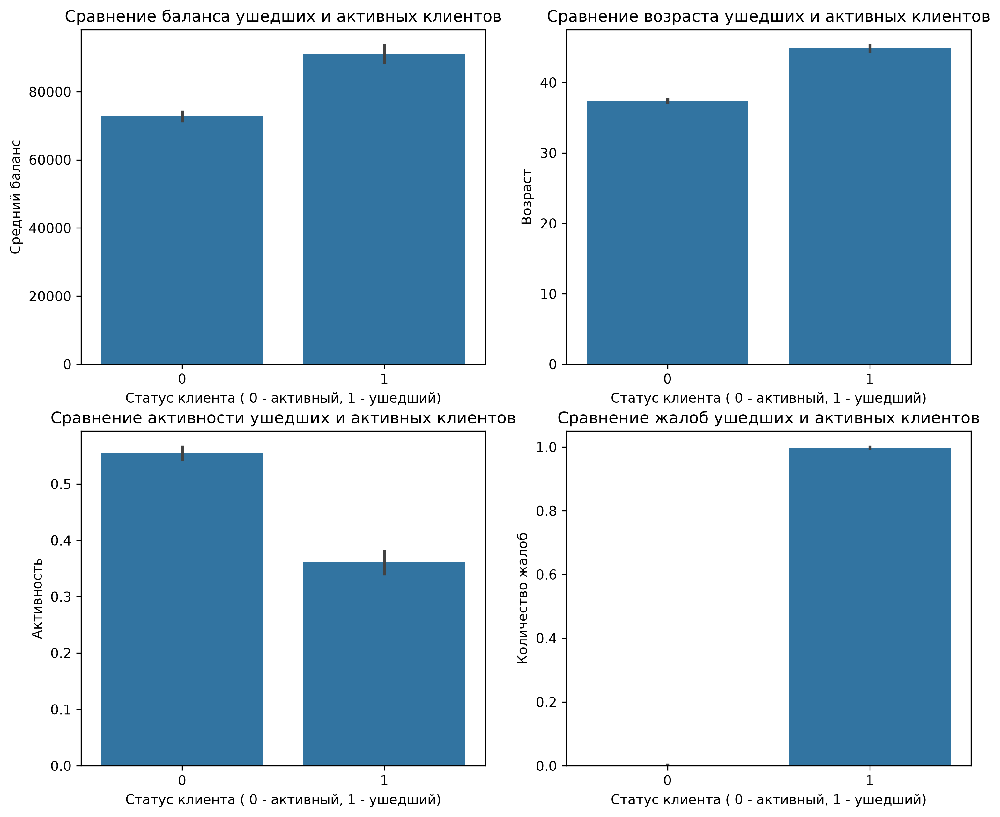

# Bank Churn Analysis (Анализ оттока клиентов банка)

Анализ оттока клиентов банка. Задача была найти закономерности: почему люди закрывают счета и уходят.

## Стек
- SQL 
- Python / Pandas / Seaborn 

## Результаты
Покрутил данные через группировки, вот основные моменты:
- **Возраст и деньги:** Банк теряет зрелых клиентов (в среднем 45 лет против 37) с нормальным балансом на счете (~91k против ~73k). 
- **Жалобы:** Практически 100% ушедших оставляли жалобы. Если саппорт не решил проблему — клиент уходит.
- **Активность:** Ушедшие намного реже заходят в приложуху и пользуются продуктами (активных всего 36% против 55%).

## Графики

